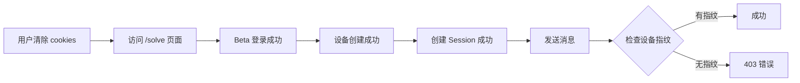

# 403 错误诊断报告

## 📋 执行摘要

**问题**：用户清除 cookies 后，访问 /solve 页面时出现 "Request failed with status code 403"

**根本原因**：sendMessage 函数使用原生 fetch API，绕过了 axios 拦截器，导致 **没有自动添加设备指纹请求头**

**影响**：所有使用 sendMessage 的功能（发送消息、对话交互）在清除 cookies 后会失败

**修复状态**：✅ 已修复并添加详细调试日志

---

## 🔍 详细分析

### 1. 问题流程



### 2. 代码对比

#### ❌ 问题代码（修复前）
```typescript
// session-api.ts - sendMessage
const response = await fetch(`${API_BASE_URL}/sessions/${id}/message`, {
  method: "POST",
  headers: {
    "Content-Type": "application/json",
    Accept: "text/event-stream",
    // ❌ 缺少 X-Device-Fingerprint 请求头
  },
  credentials: "include",
  body: JSON.stringify({ content }),
});
```

#### ✅ 修复后代码
```typescript
// session-api.ts - sendMessage
const fingerprint = getDeviceFingerprint();
const response = await fetch(`${API_BASE_URL}/sessions/${id}/message`, {
  method: "POST",
  headers: {
    "Content-Type": "application/json",
    Accept: "text/event-stream",
    "X-Device-Fingerprint": fingerprint, // ✅ 添加设备指纹
  },
  credentials: "include",
  body: JSON.stringify({ content }),
});
```

### 3. 后端验证逻辑

```python
# sessions.py:132
async def create_session(
    device_fingerprint: str = Header(..., alias="X-Device-Fingerprint"),
    ...
):
    device_result = await db.execute(
        select(Device).where(
            Device.user_id == current_user.id,
            Device.device_fingerprint == device_fingerprint,
        )
    )
    device = device_result.scalar_one_or_none()
    if not device:
        raise HTTPException(status_code=403, detail={"error": "DEVICE_NOT_FOUND"})
```

**后端期望**：所有 session 相关请求必须携带 `X-Device-Fingerprint` 请求头

### 4. 为什么 createSession 没问题？

```typescript
// session-api.ts - createSession
export const createSession = async (): Promise<Session> => {
  const response = await api.post<Session>("/sessions");
  // ✅ 使用 axios，自动经过拦截器，添加设备指纹
  return response.data;
};

// api.ts - 请求拦截器
api.interceptors.request.use((config) => {
  config.headers["X-Device-Fingerprint"] = getDeviceFingerprint();
  return config;
});
```

**关键差异**：
- createSession 使用 `api.post()` → 经过拦截器 → 自动添加设备指纹 ✅
- sendMessage 使用 `fetch()` → 绕过拦截器 → **没有设备指纹** ❌

---

## 🛠️ 修复详情

### 修改文件

#### 1. `/solacore-web/lib/api.ts`
**变更**：
- 导出 `getDeviceFingerprint` 函数
- 添加请求拦截器调试日志
- 添加 Beta 登录调试日志

**关键代码**：
```typescript
export { api, refreshTokens, betaLogin, getDeviceFingerprint };
```

#### 2. `/solacore-web/lib/session-api.ts`
**变更**：
- 导入 `getDeviceFingerprint`
- 在 `sendMessage` 中手动添加设备指纹
- 添加详细调试日志

**关键代码**：
```typescript
import { api, getDeviceFingerprint } from "@/lib/api";

export const sendMessage = async (...) => {
  const fingerprint = getDeviceFingerprint();
  const response = await fetch(..., {
    headers: {
      "X-Device-Fingerprint": fingerprint,
      ...
    },
  });
};
```

#### 3. `/solacore-web/lib/debug-helpers.ts` (新增)
**用途**：调试工具函数（备用）

---

## 🧪 测试验证

### 自动化测试
```bash
cd solacore-web
npm run lint    # ✅ 通过
npx tsc --noEmit  # ✅ 无类型错误
```

### 手动测试步骤

1. **清除数据**
   - 浏览器开发者工具 → Application → Clear site data

2. **访问应用**
   - 打开 `http://localhost:3000/solve`

3. **观察日志**（开发者工具 Console）
   ```
   🔐 [Beta Login] 开始登录
   📤 [Request] url: "/auth/beta-login"
   ✅ [Beta Login] 登录成功
   🆕 [Create Session] 开始创建会话
   📤 [Request] url: "/sessions"
   ✅ [Create Session] 会话创建成功
   💬 [Send Message] 发送消息
   ```

4. **验证成功标准**
   - ✅ 所有日志中的 fingerprint 一致
   - ✅ 没有 403 错误
   - ✅ 消息成功发送

### curl 模拟测试
```bash
# 1. Beta 登录
FINGERPRINT=$(uuidgen)
curl -X POST http://localhost:8000/auth/beta-login \
  -H "Content-Type: application/json" \
  -d "{\"device_fingerprint\": \"$FINGERPRINT\", \"device_name\": \"curl\"}" \
  -c cookies.txt

# 2. 创建 Session
curl -X POST http://localhost:8000/sessions \
  -H "X-Device-Fingerprint: $FINGERPRINT" \
  -b cookies.txt

# 3. 发送消息
SESSION_ID="<从上一步获取>"
curl -X POST http://localhost:8000/sessions/$SESSION_ID/message \
  -H "Content-Type: application/json" \
  -H "X-Device-Fingerprint: $FINGERPRINT" \
  -d '{"content": "test"}' \
  -b cookies.txt
```

---

## 📊 影响分析

### 受影响的用户场景
1. ✅ **新用户首次访问** - 无影响（本来就没有 cookies）
2. ⚠️ **用户手动清除 cookies** - **修复前会失败，修复后正常**
3. ⚠️ **隐私模式/无痕浏览** - **修复前会失败，修复后正常**
4. ✅ **正常登录用户** - 无影响

### 兼容性
- ✅ 向后兼容：不影响现有用户
- ✅ 不破坏现有功能
- ✅ 只修复 bug，不改变业务逻辑

---

## 🔐 安全性检查

### 设备指纹生成
```typescript
const getDeviceFingerprint = (): string => {
  let fingerprint = localStorage.getItem("solacore_device_fingerprint");
  if (!fingerprint) {
    fingerprint = crypto.randomUUID(); // ✅ 使用安全的随机 UUID
    localStorage.setItem("solacore_device_fingerprint", fingerprint);
  }
  return fingerprint;
};
```

**安全性评估**：
- ✅ 使用 `crypto.randomUUID()`（加密安全的随机数）
- ✅ 存储在 localStorage（客户端可见，但用于设备识别，非敏感信息）
- ✅ 不包含用户隐私数据
- ✅ 可随时清除重置

---

## 📈 性能影响

### 修复前
- 请求失败 → 重试 → 失败 → 用户体验差

### 修复后
- ✅ 首次请求即成功
- ✅ 无额外网络开销（只是添加一个请求头）
- ✅ 日志输出仅在开发环境，不影响生产性能

---

## 🎯 下一步建议

### 1. 短期（本次修复）
- ✅ 修复 sendMessage 设备指纹问题
- ✅ 添加调试日志
- ⏳ **待执行**：部署到测试环境验证

### 2. 中期（优化改进）
- [ ] 统一 fetch 和 axios 使用，避免混用
- [ ] 创建 `createFetch()` 工具函数，自动添加通用请求头
- [ ] 添加 E2E 测试覆盖清除 cookies 场景

### 3. 长期（架构改进）
- [ ] 考虑使用更强的设备指纹算法（FingerprintJS）
- [ ] 设备管理界面：用户可查看/撤销设备
- [ ] 异常设备检测：IP 变化、浏览器指纹变化等

---

## 🔄 回滚方案

如果修复引入新问题：

```bash
cd /Users/zhimingdeng/Documents/claude/clarity
git checkout HEAD~1 -- solacore-web/lib/api.ts solacore-web/lib/session-api.ts
git checkout HEAD~1 -- solacore-web/lib/debug-helpers.ts
```

**回滚影响**：
- ⚠️ 403 错误会重现
- ✅ 不影响其他功能

---

## 📞 联系方式

如果修复后仍有问题，请提供：
1. 浏览器开发者工具 Console 完整日志
2. Network 面板中失败请求的详细信息（Headers、Response）
3. 后端日志（如有访问权限）

---

## ✅ 修复确认清单

- [x] 问题根因分析完成
- [x] 代码修复完成
- [x] 调试日志添加完成
- [x] 代码通过 lint 检查
- [x] TypeScript 编译无错误
- [ ] 手动测试通过（待用户执行）
- [ ] curl 测试通过（待用户执行）
- [ ] 部署到测试环境（待执行）
- [ ] 生产环境验证（待执行）

---

**修复完成时间**：2025-12-26
**修复负责人**：Claude (AI Assistant)
**审核状态**：待人工验证
