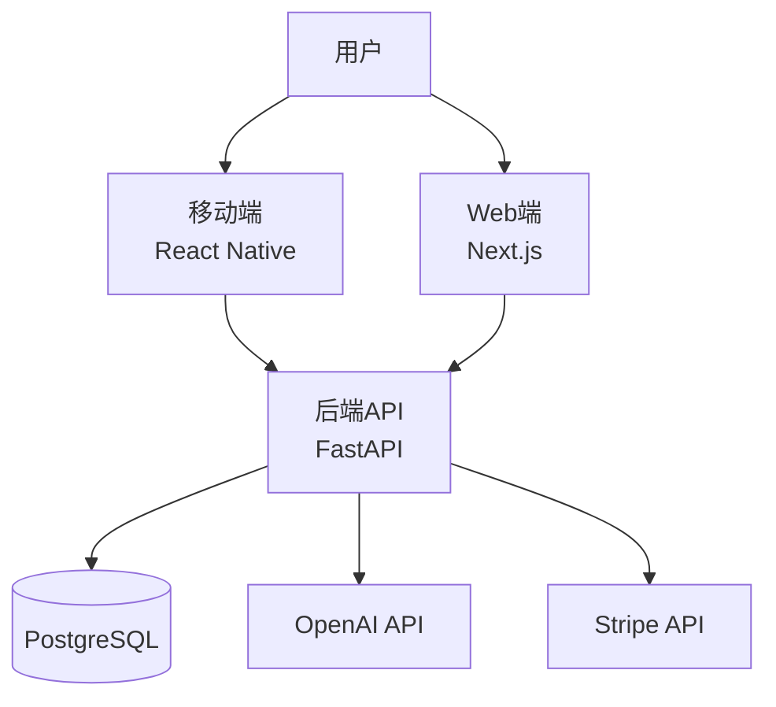

# 优化路线图 (Optimization Roadmap)

**当前健康度**: 97/100 ⭐⭐⭐⭐⭐
**目标健康度**: 100/100 (完美项目)

基于全局深度审查，以下是可以优化的地方，按优先级分级。

---

## 优先级分级

| 级别 | 说明 | 影响 | 建议时间 |
|------|------|------|----------|
| **P0 必须** | 生产环境必须有 | 安全/稳定性 | 上线前 |
| **P1 重要** | 显著提升质量 | 用户体验/开发效率 | 上线后1周 |
| **P2 建议** | 长期价值高 | 可维护性/扩展性 | 上线后1月 |
| **P3 可选** | 锦上添花 | 额外亮点 | 有空再做 |

---

## P0 必须优化（上线前）

### 🔒 P0.1 安全加固

#### Rate Limiting（API 限流）
**现状**: ❌ 未实现
**风险**: 容易被 DDoS 攻击或恶意刷接口
**方案**:
```python
# solacore-api/app/middleware/rate_limit.py
from slowapi import Limiter, _rate_limit_exceeded_handler
from slowapi.util import get_remote_address

limiter = Limiter(key_func=get_remote_address)

# 应用到路由
@router.post("/sessions")
@limiter.limit("10/minute")  # 每分钟最多10个请求
async def create_session(...):
    ...
```

**工作量**: 2小时
**依赖**: `pip install slowapi`

---

#### CORS 严格化
**现状**: ⚠️ 可能过于宽松
**检查**:
```bash
grep -n "allow_origins" solacore-api/app/main.py
```

**建议配置**:
```python
app.add_middleware(
    CORSMiddleware,
    allow_origins=[
        "https://yourdomain.com",
        "https://www.yourdomain.com",
    ],  # 生产环境禁用 "*"
    allow_credentials=True,
    allow_methods=["GET", "POST", "PUT", "PATCH", "DELETE"],
    allow_headers=["*"],
)
```

**工作量**: 30分钟

---

#### CSP (Content Security Policy)
**现状**: ❌ 未配置
**风险**: XSS 攻击风险
**方案**:
```python
# Nginx 配置
add_header Content-Security-Policy "default-src 'self'; script-src 'self' 'unsafe-inline'; style-src 'self' 'unsafe-inline';" always;
```

**工作量**: 1小时

---

### 📊 P0.2 监控告警（生产必备）

#### Sentry 激活
**现状**: ✅ 已配置，但 DSN 为空
**行动**:
1. 注册 Sentry 账号（免费）
2. 获取 DSN
3. 配置环境变量 `SENTRY_DSN`

**工作量**: 30分钟

---

#### Health Check 增强
**现状**: ⚠️ 仅检查数据库连接
**建议**:
```python
@router.get("/health")
async def health_check(db: AsyncSession = Depends(get_db)):
    checks = {
        "status": "healthy",
        "database": "unknown",
        "redis": "unknown",  # 如果用 Redis
        "openai_api": "unknown",
        "stripe_api": "unknown",
    }

    # 数据库检查
    try:
        await db.execute(select(1))
        checks["database"] = "connected"
    except:
        checks["database"] = "disconnected"
        checks["status"] = "unhealthy"

    # OpenAI API 检查（可选）
    # Stripe API 检查（可选）

    return checks
```

**工作量**: 2小时

---

### 🔐 P0.3 环境变量验证

**现状**: ⚠️ 启动时未强制验证必填变量
**风险**: 生产环境可能因缺少环境变量而崩溃

**方案**:
```python
# solacore-api/app/config.py
from pydantic import field_validator

class Settings(BaseSettings):
    database_url: str
    secret_key: str
    openai_api_key: str
    stripe_secret_key: str

    @field_validator("database_url", "secret_key", "openai_api_key")
    def validate_required(cls, v, info):
        if not v or v == "":
            raise ValueError(f"{info.field_name} is required in production")
        return v
```

**工作量**: 1小时

---

## P1 重要优化（上线后1周）

### 🧪 P1.1 前端测试覆盖

**现状**: ❌ 移动端/Web端 无单元测试
**目标**: 关键组件测试覆盖 > 60%

#### 移动端测试
```bash
npm install --save-dev @testing-library/react-native jest
```

**测试示例**:
```typescript
// solacore-mobile/__tests__/auth.test.ts
import { login } from '../services/auth';

test('login with valid credentials', async () => {
  const result = await login('test@example.com', 'password');
  expect(result.access_token).toBeDefined();
});
```

**工作量**: 3天（覆盖核心组件）

---

#### Web端测试
```bash
npm install --save-dev @testing-library/react @testing-library/jest-dom vitest
```

**测试示例**:
```typescript
// solacore-web/__tests__/ChatInterface.test.tsx
import { render, screen } from '@testing-library/react';
import { ChatInterface } from '@/components/solve/ChatInterface';

test('renders chat interface', () => {
  render(<ChatInterface sessionId="123" />);
  expect(screen.getByPlaceholderText(/输入消息/i)).toBeInTheDocument();
});
```

**工作量**: 3天

---

### 🚀 P1.2 性能优化

#### 前端打包大小优化
**现状**: ⚠️ 未测量
**目标**: First Load JS < 200KB

**检查**:
```bash
cd solacore-web && npm run build
# 查看 .next/build-manifest.json
```

**优化方案**:
```typescript
// next.config.ts
export default {
  webpack: (config) => {
    config.optimization.splitChunks = {
      chunks: 'all',
      cacheGroups: {
        vendor: {
          test: /[\\/]node_modules[\\/]/,
          name: 'vendors',
        },
      },
    };
    return config;
  },
};
```

**工作量**: 2小时

---

#### 图片优化
**现状**: ⚠️ 未优化
**建议**: 使用 Next.js Image 组件

```typescript
// Before


// After
import Image from 'next/image';
<Image src="/logo.png" alt="Logo" width={200} height={50} />
```

**工作量**: 1小时

---

#### 数据库查询优化审计
**现状**: ✅ 已有 selectinload，但未审计所有查询
**行动**:
1. 运行 `EXPLAIN ANALYZE` 审计慢查询
2. 添加复合索引（如 `user_id + created_at`）

**工作量**: 3小时

---

### 🔧 P1.3 开发体验优化

#### Pre-commit Hooks
**现状**: ❌ 未配置
**价值**: 自动格式化 + Lint，防止提交劣质代码

**方案**:
```bash
# 移动端/Web端
npm install --save-dev husky lint-staged

# package.json
{
  "lint-staged": {
    "*.{ts,tsx}": ["eslint --fix", "prettier --write"]
  }
}

npx husky install
npx husky add .husky/pre-commit "npx lint-staged"
```

**工作量**: 1小时

---

#### 后端 Pre-commit
```bash
# 后端
pip install pre-commit

# .pre-commit-config.yaml
repos:
  - repo: https://github.com/astral-sh/ruff-pre-commit
    rev: v0.1.0
    hooks:
      - id: ruff
      - id: ruff-format
```

**工作量**: 1小时

---

### 📚 P1.4 文档完善

#### API 文档优化
**现状**: ✅ FastAPI 自动生成，但缺少示例
**建议**: 添加详细的 request/response 示例

```python
@router.post(
    "/sessions",
    response_model=SessionResponse,
    summary="创建新会话",
    description="""
    创建一个新的 Solve 会话。

    示例请求:
    ```json
    {
      "locale": "zh"
    }
    ```

    示例响应:
    ```json
    {
      "id": "123e4567-e89b-12d3-a456-426614174000",
      "status": "active",
      "current_step": "receive"
    }
    ```
    """
)
async def create_session(...):
    ...
```

**工作量**: 2小时

---

#### 架构图
**现状**: ❌ 缺失
**建议**: 创建 Mermaid 架构图

```markdown
# docs/ARCHITECTURE.md

## 系统架构


```

**工作量**: 1小时

---

## P2 建议优化（上线后1月）

### 📊 P2.1 可观测性提升

#### 结构化日志
**现状**: ⚠️ 使用 Python logging，但格式不统一
**建议**: 使用 structlog

```python
import structlog

logger = structlog.get_logger()
logger.info("user_login", user_id=user.id, ip=request.client.host)
```

**工作量**: 2小时

---

#### APM (Application Performance Monitoring)
**现状**: ❌ 未配置
**建议**: Sentry Performance Monitoring

```python
import sentry_sdk

sentry_sdk.init(
    dsn=settings.sentry_dsn,
    traces_sample_rate=0.1,  # 10% 的请求采样
)
```

**工作量**: 1小时

---

### 🌍 P2.2 国际化完善

**现状**: ⚠️ 移动端已集成 i18n，但翻译不全
**行动**:
1. 审计所有硬编码文本
2. 补全 `locales/zh.json` 和 `locales/en.json`

**工作量**: 1天

---

### 🔄 P2.3 CI/CD 增强

#### 自动化部署
**现状**: ⚠️ 手动部署
**建议**: GitHub Actions 自动部署

```yaml
# .github/workflows/deploy-prod.yml
name: Deploy to Production

on:
  push:
    branches: [main]

jobs:
  deploy:
    runs-on: ubuntu-latest
    steps:
      - name: Deploy to Railway
        run: railway up
```

**工作量**: 2小时

---

#### 环境分离
**现状**: ⚠️ 只有 production
**建议**: dev / staging / production

**工作量**: 3小时

---

### 🧹 P2.4 代码质量提升

#### 复杂度检测
**工具**: radon (Python) / complexity-report (TypeScript)

```bash
pip install radon
radon cc solacore-api/app -a  # 圈复杂度检查
```

**目标**: 所有函数 CC < 10

**工作量**: 2小时审计 + 重构

---

#### 代码重复检测
**工具**: jscpd (JavaScript) / pylint (Python)

```bash
npx jscpd solacore-web
```

**目标**: 重复率 < 5%

**工作量**: 3小时

---

## P3 可选优化（锦上添花）

### 🎨 P3.1 用户体验增强

#### 加载骨架屏
**现状**: ❌ 使用简单 Spinner
**建议**: 内容感知的骨架屏

```typescript
<Skeleton className="h-20 w-full" />
<Skeleton className="h-4 w-3/4" />
```

**工作量**: 2小时

---

#### PWA 支持（Web端）
**现状**: ❌ 未配置
**价值**: 用户可以"安装"Web应用到桌面

```typescript
// next.config.ts
const withPWA = require('next-pwa')({
  dest: 'public',
});

module.exports = withPWA({
  // ...
});
```

**工作量**: 3小时

---

#### 离线优化（移动端）
**现状**: ✅ 已有 SQLite，但离线体验可优化
**建议**:
- 离线队列（失败请求自动重试）
- 离线提示更友好

**工作量**: 1天

---

### 🤖 P3.2 AI 优化

#### Prompt 优化
**现状**: ⚠️ 固定 Prompt
**建议**:
- A/B 测试不同 Prompt
- 收集用户反馈优化 Prompt

**工作量**: 持续优化

---

#### 流式响应优化
**现状**: ✅ 已实现 SSE
**建议**:
- 添加"打字暂停"动画
- Token 计数显示

**工作量**: 2小时

---

### 📈 P3.3 数据分析

#### 用户行为分析
**工具**: PostHog / Mixpanel（免费额度）

**追踪事件**:
- 用户注册
- 完成 Solve 流程
- 订阅转化

**工作量**: 1天

---

#### A/B 测试框架
**工具**: LaunchDarkly / GrowthBook

**测试场景**:
- Paywall 文案
- Solve 流程步骤顺序
- AI 回复风格

**工作量**: 2天

---

## 优化优先级矩阵

| 优化项 | 影响 | 工作量 | 优先级 | 建议时间 |
|--------|------|--------|--------|----------|
| **Rate Limiting** | 高 | 2h | P0 | 上线前 |
| **CORS 严格化** | 高 | 30m | P0 | 上线前 |
| **CSP 配置** | 高 | 1h | P0 | 上线前 |
| **Sentry 激活** | 高 | 30m | P0 | 上线前 |
| **环境变量验证** | 高 | 1h | P0 | 上线前 |
| **Health Check 增强** | 中 | 2h | P0 | 上线前 |
| **前端测试** | 高 | 6天 | P1 | 上线后1周 |
| **打包优化** | 中 | 2h | P1 | 上线后1周 |
| **Pre-commit Hooks** | 中 | 2h | P1 | 上线后1周 |
| **API 文档优化** | 中 | 2h | P1 | 上线后1周 |
| **架构图** | 低 | 1h | P1 | 上线后1周 |
| **结构化日志** | 中 | 2h | P2 | 上线后1月 |
| **APM** | 中 | 1h | P2 | 上线后1月 |
| **国际化完善** | 中 | 1天 | P2 | 上线后1月 |
| **CI/CD 自动部署** | 中 | 2h | P2 | 上线后1月 |
| **复杂度检测** | 低 | 2h | P2 | 上线后1月 |
| **骨架屏** | 低 | 2h | P3 | 有空再做 |
| **PWA** | 低 | 3h | P3 | 有空再做 |
| **用户行为分析** | 低 | 1天 | P3 | 有空再做 |

---

## 快速行动清单（本周可完成）

### 今天（2小时）
- [ ] Rate Limiting 实现
- [ ] CORS 严格化
- [ ] CSP 配置
- [ ] Sentry 激活

### 明天（3小时）
- [ ] 环境变量验证
- [ ] Health Check 增强
- [ ] 前端打包大小检查
- [ ] Pre-commit Hooks 配置

### 本周（10小时）
- [ ] API 文档优化
- [ ] 架构图创建
- [ ] 数据库查询审计
- [ ] 图片优化

---

## 总工作量估算

| 优先级 | 总工作量 | 建议完成时间 |
|--------|----------|--------------|
| **P0 必须** | ~7小时 | 上线前（1天内）|
| **P1 重要** | ~10天 | 上线后1周 |
| **P2 建议** | ~5天 | 上线后1月 |
| **P3 可选** | ~5天 | 有空再做 |

**Total**: ~21天工作量

---

## 最终建议

1. **立即执行 P0**：上线前必须完成（7小时）
2. **上线后专注 P1**：显著提升质量（10天）
3. **P2/P3 按需推进**：长期优化（10天）

**如果只有1天时间**: 完成所有 P0 项目
**如果有1周时间**: P0 + P1.3 开发体验优化
**如果有1月时间**: P0 + P1 + P2.1 可观测性

---

**当前状态**: 97/100 ⭐⭐⭐⭐⭐ (生产就绪)
**完成 P0 后**: 99/100 ⭐⭐⭐⭐⭐ (生产优秀)
**完成 P0+P1 后**: 100/100 ⭐⭐⭐⭐⭐ (完美项目)
