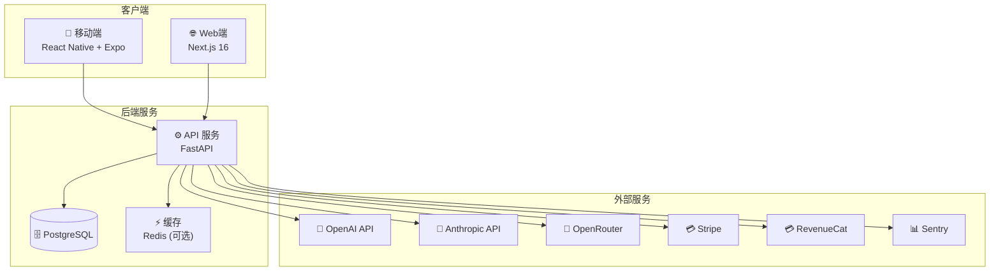
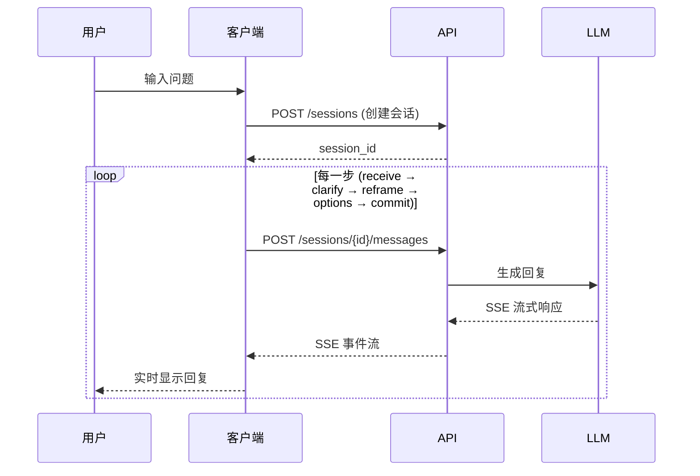

# Solacore - Architecture Document

> **Version**: 1.0
> **Last Updated**: 2025-12-21
> **Status**: Draft

---

## 🚀 Quick Visual Overview (Mermaid)

### Simplified System Architecture



### 5-Step Solve Flow



---

## Table of Contents

1. [System Overview](#1-system-overview)
2. [Module Architecture](#2-module-architecture)
3. [Data Flow](#3-data-flow)
4. [API Design](#4-api-design)
5. [Anti-Abuse & Subscription Enforcement](#5-anti-abuse--subscription-enforcement)
6. [i18n Architecture](#6-i18n-architecture)
7. [Privacy & Backup Strategy](#7-privacy--backup-strategy)
8. [Deployment](#8-deployment)

---

## 1. System Overview

### 1.1 High-Level Architecture

```
┌─────────────────────────────────────────────────────────────────────────────┐
│                              CLIENTS                                        │
├─────────────────────────────────────────────────────────────────────────────┤
│  ┌─────────────────────┐    ┌─────────────────────┐    ┌─────────────────┐  │
│  │   iOS App           │    │   Android App       │    │   Web (Optional)│  │
│  │   (React Native)    │    │   (React Native)    │    │   Landing/Admin │  │
│  │   + Expo            │    │   + Expo            │    │   (Next.js)     │  │
│  └──────────┬──────────┘    └──────────┬──────────┘    └────────┬────────┘  │
│             │                          │                        │           │
│             └──────────────────────────┼────────────────────────┘           │
│                                        │                                    │
│                                   HTTPS/WSS                                 │
│                                        │                                    │
└────────────────────────────────────────┼────────────────────────────────────┘
                                         │
┌────────────────────────────────────────┼────────────────────────────────────┐
│                              SINGLE SERVER                                  │
├────────────────────────────────────────┼────────────────────────────────────┤
│                                        ▼                                    │
│  ┌─────────────────────────────────────────────────────────────────────┐   │
│  │                         NGINX (Reverse Proxy)                        │   │
│  │                    SSL Termination + Rate Limiting                   │   │
│  └─────────────────────────────────┬───────────────────────────────────┘   │
│                                    │                                        │
│                                    ▼                                        │
│  ┌─────────────────────────────────────────────────────────────────────┐   │
│  │                         FastAPI Application                          │   │
│  │  ┌───────────┐ ┌───────────┐ ┌───────────┐ ┌───────────────────┐   │   │
│  │  │   Auth    │ │  Session  │ │Subscription│ │    Anti-Abuse     │   │   │
│  │  │  Service  │ │  Service  │ │  Service   │ │     Middleware    │   │   │
│  │  └───────────┘ └───────────┘ └───────────┘ └───────────────────┘   │   │
│  │  ┌───────────────────────────────────────────────────────────────┐   │   │
│  │  │                      AI Service (LLM Wrapper)                  │   │   │
│  │  │               OpenAI / Anthropic Claude API                    │   │   │
│  │  └───────────────────────────────────────────────────────────────┘   │   │
│  └─────────────────────────────────┬───────────────────────────────────┘   │
│                                    │                                        │
│                                    ▼                                        │
│  ┌─────────────────────────────────────────────────────────────────────┐   │
│  │                         PostgreSQL Database                          │   │
│  │         Users │ Devices │ Sessions │ Subscriptions │ Usage           │   │
│  └─────────────────────────────────────────────────────────────────────┘   │
│                                                                             │
└─────────────────────────────────────────────────────────────────────────────┘
```

### 1.2 Technology Stack

| Layer | Technology | Rationale |
|-------|------------|-----------|
| **Mobile App** | React Native + Expo | Cross-platform, fast iteration, OTA updates |
| **Web (Optional)** | Next.js | Landing page, admin dashboard |
| **Backend API** | FastAPI (Python) | Lightweight, async, auto OpenAPI docs |
| **Database** | PostgreSQL | Reliable, JSONB for flexible storage |
| **AI Integration** | OpenAI / Claude API | Direct API calls, no middleware |
| **Auth** | JWT + OAuth2 | Stateless, mobile-friendly |
| **Payments** | Stripe SDK | Direct integration, handles SCA |

### 1.3 Design Principles

1. **Mobile-First**: Primary experience on iOS/Android via Expo
2. **Single-Server Deployable**: No microservices, no distributed cache
3. **Local-First Privacy**: Conversation content stays on device
4. **Minimal Server State**: Only store auth, subscription, usage metrics

---

## 2. Module Architecture

### 2.1 Mobile App (React Native + Expo)

```
solacore-mobile/
├── app/                      # Expo Router (file-based routing)
│   ├── (auth)/               # Auth screens (login, signup)
│   ├── (main)/               # Main app screens
│   │   ├── index.tsx         # Home / New session
│   │   ├── session/[id].tsx  # Active Solve session
│   │   ├── history.tsx       # Past sessions (paid only)
│   │   └── settings.tsx      # Account, subscription
│   └── _layout.tsx           # Root layout
├── components/
│   ├── chat/                 # Chat UI components
│   │   ├── MessageBubble.tsx
│   │   ├── InputBar.tsx
│   │   ├── OptionCard.tsx    # Solve Step 4 options
│   │   └── EmotionGradient.tsx
│   ├── auth/
│   └── subscription/
├── services/
│   ├── api.ts                # API client (fetch wrapper)
│   ├── auth.ts               # Auth state, token management
│   ├── session.ts            # Solve session logic
│   └── storage.ts            # Local storage (SQLite/AsyncStorage)
├── hooks/
│   ├── useAuth.ts
│   ├── useSession.ts
│   └── useSubscription.ts
├── i18n/
│   ├── en.json
│   ├── es.json
│   └── zh.json
├── stores/                   # Zustand state management
│   ├── authStore.ts
│   ├── sessionStore.ts
│   └── settingsStore.ts
└── utils/
    ├── deviceFingerprint.ts  # Device ID generation
    └── emotionDetector.ts    # Client-side emotion hints
```

**Key Decisions:**
- **Expo Router** for file-based navigation
- **Zustand** for lightweight state (not Redux)
- **SQLite** (via expo-sqlite) for local conversation storage
- **Secure Store** (expo-secure-store) for tokens

### 2.2 Backend API (FastAPI)

```
solacore-api/
├── app/
│   ├── main.py               # FastAPI app entry
│   ├── config.py             # Settings (env vars)
│   ├── database.py           # SQLAlchemy + async engine
│   │
│   ├── routers/
│   │   ├── auth.py           # /auth/*
│   │   ├── sessions.py       # /sessions/*
│   │   ├── subscriptions.py  # /subscriptions/*
│   │   └── webhooks.py       # /webhooks/stripe
│   │
│   ├── services/
│   │   ├── auth_service.py
│   │   ├── session_service.py
│   │   ├── subscription_service.py
│   │   ├── ai_service.py     # LLM wrapper
│   │   └── abuse_service.py  # Anti-abuse logic
│   │
│   ├── middleware/
│   │   ├── auth.py           # JWT verification
│   │   ├── subscription.py   # Tier + quota check
│   │   ├── rate_limit.py     # Per-user rate limiting
│   │   └── device.py         # Device binding check
│   │
│   ├── models/               # SQLAlchemy models
│   │   ├── user.py
│   │   ├── device.py
│   │   ├── session.py        # Solve session metadata only
│   │   ├── subscription.py
│   │   └── usage.py
│   │
│   ├── schemas/              # Pydantic schemas
│   │   ├── auth.py
│   │   ├── session.py
│   │   └── subscription.py
│   │
│   └── utils/
│       ├── security.py       # Password hashing, JWT
│       ├── stripe_client.py
│       └── llm_client.py
│
├── migrations/               # Alembic migrations
├── tests/
├── requirements.txt
└── Dockerfile
```

### 2.3 Database Schema

```sql
-- Users table
CREATE TABLE users (
    id UUID PRIMARY KEY DEFAULT gen_random_uuid(),
    email VARCHAR(255) UNIQUE NOT NULL,
    password_hash VARCHAR(255),          -- NULL for OAuth users
    auth_provider VARCHAR(50) DEFAULT 'email',  -- email/google/apple
    auth_provider_id VARCHAR(255),       -- OAuth user ID
    locale VARCHAR(10) DEFAULT 'en',
    created_at TIMESTAMP DEFAULT NOW(),
    updated_at TIMESTAMP DEFAULT NOW()
);

-- Devices table (for anti-abuse)
CREATE TABLE devices (
    id UUID PRIMARY KEY DEFAULT gen_random_uuid(),
    user_id UUID REFERENCES users(id) ON DELETE CASCADE,
    device_fingerprint VARCHAR(255) NOT NULL,
    device_name VARCHAR(255),            -- "iPhone 15", "Pixel 8"
    platform VARCHAR(50),                -- ios/android
    last_active_at TIMESTAMP DEFAULT NOW(),
    is_active BOOLEAN DEFAULT TRUE,
    created_at TIMESTAMP DEFAULT NOW(),
    UNIQUE(user_id, device_fingerprint)
);

-- Active sessions (for concurrent session limiting)
CREATE TABLE active_sessions (
    id UUID PRIMARY KEY DEFAULT gen_random_uuid(),
    user_id UUID REFERENCES users(id) ON DELETE CASCADE,
    device_id UUID REFERENCES devices(id) ON DELETE CASCADE,
    token_hash VARCHAR(255) NOT NULL,    -- Hashed refresh token
    expires_at TIMESTAMP NOT NULL,
    created_at TIMESTAMP DEFAULT NOW()
);

-- Subscriptions table
CREATE TABLE subscriptions (
    id UUID PRIMARY KEY DEFAULT gen_random_uuid(),
    user_id UUID UNIQUE REFERENCES users(id) ON DELETE CASCADE,
    tier VARCHAR(50) DEFAULT 'free',     -- free/standard/pro/org
    stripe_customer_id VARCHAR(255),
    stripe_subscription_id VARCHAR(255),
    status VARCHAR(50) DEFAULT 'active', -- active/canceled/past_due
    current_period_start TIMESTAMP,
    current_period_end TIMESTAMP,
    created_at TIMESTAMP DEFAULT NOW(),
    updated_at TIMESTAMP DEFAULT NOW()
);

-- Usage tracking
CREATE TABLE usage (
    id UUID PRIMARY KEY DEFAULT gen_random_uuid(),
    user_id UUID REFERENCES users(id) ON DELETE CASCADE,
    period_start DATE NOT NULL,          -- First day of billing period
    session_count INTEGER DEFAULT 0,
    created_at TIMESTAMP DEFAULT NOW(),
    updated_at TIMESTAMP DEFAULT NOW(),
    UNIQUE(user_id, period_start)
);

-- Solve sessions (metadata only - content stays on device)
CREATE TABLE solve_sessions (
    id UUID PRIMARY KEY DEFAULT gen_random_uuid(),
    user_id UUID REFERENCES users(id) ON DELETE CASCADE,
    device_id UUID REFERENCES devices(id),
    status VARCHAR(50) DEFAULT 'active', -- active/completed/abandoned
    current_step VARCHAR(50),            -- receive/clarify/reframe/options/commit
    started_at TIMESTAMP DEFAULT NOW(),
    completed_at TIMESTAMP
);

-- Rate limiting (in-memory preferred, DB fallback)
CREATE TABLE rate_limits (
    user_id UUID REFERENCES users(id) ON DELETE CASCADE,
    window_start TIMESTAMP NOT NULL,
    request_count INTEGER DEFAULT 0,
    PRIMARY KEY (user_id, window_start)
);

-- Indexes
CREATE INDEX idx_devices_user ON devices(user_id);
CREATE INDEX idx_active_sessions_user ON active_sessions(user_id);
CREATE INDEX idx_usage_user_period ON usage(user_id, period_start);
CREATE INDEX idx_solve_sessions_user ON solve_sessions(user_id);
```

---

## 3. Data Flow

### 3.1 Authentication Flow

```
┌─────────┐     ┌─────────┐     ┌─────────┐     ┌─────────┐
│  Mobile │     │  FastAPI│     │   DB    │     │ OAuth   │
│   App   │     │   API   │     │         │     │ Provider│
└────┬────┘     └────┬────┘     └────┬────┘     └────┬────┘
     │               │               │               │
     │ 1. Login Request               │               │
     │ (email+password OR oauth token)│               │
     ├──────────────►│               │               │
     │               │               │               │
     │               │ 2. Validate   │               │
     │               ├──────────────►│ (or)──────────►
     │               │               │               │
     │               │ 3. Generate device fingerprint │
     │               │    Check device binding        │
     │               ├──────────────►│               │
     │               │               │               │
     │               │ 4. Check concurrent sessions   │
     │               ├──────────────►│               │
     │               │               │               │
     │               │ 5. Issue JWT (access + refresh)│
     │◄──────────────┤               │               │
     │               │               │               │
     │ 6. Store tokens securely      │               │
     │    (expo-secure-store)        │               │
     │               │               │               │
```

### 3.2 Solve Session Flow

```
┌─────────┐     ┌─────────┐     ┌─────────┐     ┌─────────┐
│  Mobile │     │  FastAPI│     │   DB    │     │  LLM    │
│   App   │     │   API   │     │         │     │  API    │
└────┬────┘     └────┬────┘     └────┬────┘     └────┬────┘
     │               │               │               │
     │ 1. POST /sessions/new         │               │
     │    {device_fingerprint}       │               │
     ├──────────────►│               │               │
     │               │               │               │
     │               │ 2. Middleware chain:          │
     │               │    - Auth (JWT valid?)        │
     │               │    - Device (bound?)          │
     │               │    - Subscription (quota?)    │
     │               │    - Rate limit (throttle?)   │
     │               ├──────────────►│               │
     │               │               │               │
     │               │ 3. Create session, inc usage  │
     │               ├──────────────►│               │
     │               │               │               │
     │◄──────────────┤ 4. Return session_id          │
     │               │               │               │
     │ 5. POST /sessions/{id}/message│               │
     │    {content, step: "receive"} │               │
     ├──────────────►│               │               │
     │               │               │               │
     │               │ 6. Build prompt (Solve step)  │
     │               │    Strip PII from content     │
     │               ├───────────────────────────────►
     │               │               │               │
     │               │◄──────────────────────────────┤
     │               │ 7. LLM response               │
     │               │               │               │
     │◄──────────────┤ 8. Stream response (SSE)      │
     │               │               │               │
     │ 9. Store message locally      │               │
     │    (SQLite on device)         │               │
     │               │               │               │
```

### 3.3 Subscription Check Flow

```
Every API request with @requires_subscription decorator:

┌──────────────────────────────────────────────────────────────────────┐
│                        Request Arrives                               │
└────────────────────────────────┬─────────────────────────────────────┘
                                 │
                                 ▼
┌──────────────────────────────────────────────────────────────────────┐
│ 1. Auth Middleware: Verify JWT, extract user_id                      │
└────────────────────────────────┬─────────────────────────────────────┘
                                 │
                                 ▼
┌──────────────────────────────────────────────────────────────────────┐
│ 2. Device Middleware: Check device_fingerprint in header             │
│    - If new device + user has max devices → 403 DEVICE_LIMIT         │
│    - If device not bound to user → 403 DEVICE_MISMATCH               │
└────────────────────────────────┬─────────────────────────────────────┘
                                 │
                                 ▼
┌──────────────────────────────────────────────────────────────────────┐
│ 3. Subscription Middleware: Check tier + quota                       │
│    - Load subscription from DB (cache 5 min)                         │
│    - If tier=free AND usage >= 10 → 403 QUOTA_EXCEEDED               │
│    - If tier=standard AND usage >= 100 → prompt upgrade or overage   │
└────────────────────────────────┬─────────────────────────────────────┘
                                 │
                                 ▼
┌──────────────────────────────────────────────────────────────────────┐
│ 4. Rate Limit Middleware: Check requests/minute                      │
│    - Free: 30/min, Standard: 60/min, Pro: 120/min                    │
│    - If exceeded → 429 RATE_LIMITED                                  │
└────────────────────────────────┬─────────────────────────────────────┘
                                 │
                                 ▼
┌──────────────────────────────────────────────────────────────────────┐
│ 5. Request Handler: Process actual business logic                    │
└──────────────────────────────────────────────────────────────────────┘
```

---

## 4. API Design

### 4.1 Auth API

| Method | Endpoint | Description |
|--------|----------|-------------|
| POST | `/auth/register` | Email registration |
| POST | `/auth/login` | Email login |
| POST | `/auth/oauth/google` | Google OAuth |
| POST | `/auth/oauth/apple` | Apple Sign-In |
| POST | `/auth/refresh` | Refresh access token |
| POST | `/auth/logout` | Invalidate session |
| DELETE | `/auth/account` | Delete account (GDPR) |

**Request/Response Examples:**

```python
# POST /auth/register
Request:
{
    "email": "user@example.com",
    "password": "SecurePass123!",
    "locale": "en",
    "device_fingerprint": "abc123...",
    "device_name": "iPhone 15 Pro"
}

Response (201):
{
    "user_id": "uuid",
    "access_token": "eyJ...",
    "refresh_token": "eyJ...",
    "expires_in": 3600,
    "subscription": {
        "tier": "free",
        "sessions_remaining": 10
    }
}
```

### 4.2 Session API

| Method | Endpoint | Description |
|--------|----------|-------------|
| POST | `/sessions` | Create new Solve session |
| GET | `/sessions` | List sessions (paid only) |
| GET | `/sessions/{id}` | Get session metadata |
| POST | `/sessions/{id}/messages` | Send message (SSE response) |
| PATCH | `/sessions/{id}` | Update session status |

**Request/Response Examples:**

```python
# POST /sessions
Request:
{
    "device_fingerprint": "abc123..."
}

Response (201):
{
    "session_id": "uuid",
    "status": "active",
    "current_step": "receive",
    "usage": {
        "sessions_used": 3,
        "sessions_limit": 10,  # or null for unlimited
        "tier": "free"
    }
}

# POST /sessions/{id}/messages (SSE streaming)
Request:
{
    "content": "I'm frustrated with my job...",
    "step": "receive"
}

Response (SSE stream):
event: token
data: {"content": "I"}

event: token
data: {"content": " hear"}

event: token
data: {"content": " you"}

event: done
data: {"next_step": "clarify", "emotion_detected": "frustrated"}
```

### 4.3 Subscription API

| Method | Endpoint | Description |
|--------|----------|-------------|
| GET | `/subscriptions/plans` | List available plans |
| GET | `/subscriptions/current` | Get user's subscription |
| POST | `/subscriptions/checkout` | Create Stripe checkout |
| POST | `/subscriptions/portal` | Create Stripe portal link |
| GET | `/subscriptions/usage` | Get current usage stats |

**Request/Response Examples:**

```python
# GET /subscriptions/current
Response (200):
{
    "tier": "standard",
    "status": "active",
    "current_period_end": "2025-01-21T00:00:00Z",
    "usage": {
        "sessions_used": 45,
        "sessions_limit": 100,
        "overage_rate": 0.20
    },
    "features": {
        "history_days": 30,
        "deep_analysis": false,
        "priority_queue": false
    }
}

# POST /subscriptions/checkout
Request:
{
    "plan_id": "pro_monthly",
    "success_url": "solacore://subscription/success",
    "cancel_url": "solacore://subscription/cancel"
}

Response (200):
{
    "checkout_url": "https://checkout.stripe.com/..."
}
```

### 4.4 Webhook API

| Method | Endpoint | Description |
|--------|----------|-------------|
| POST | `/webhooks/stripe` | Stripe webhook handler |

**Handled Events:**
- `checkout.session.completed` → Activate subscription
- `invoice.paid` → Renew subscription
- `invoice.payment_failed` → Mark past_due
- `customer.subscription.deleted` → Downgrade to free

---

## 5. Anti-Abuse & Subscription Enforcement

### 5.1 Device Binding System

**Goals:**
- Prevent account sharing (e.g., 10 people using 1 Pro account)
- Allow legitimate multi-device use (user's own phone + tablet)

**Implementation:**

```python
# Device fingerprint generation (client-side)
def generate_device_fingerprint():
    """
    Combine stable device identifiers:
    - iOS: identifierForVendor
    - Android: Settings.Secure.ANDROID_ID
    - App install ID (fallback)
    """
    return hash(vendor_id + install_id + platform)

# Device limits by tier
DEVICE_LIMITS = {
    "free": 1,
    "standard": 2,
    "pro": 3,
    "org": 5  # per seat
}
```

**Device Binding Rules:**

| Scenario | Action |
|----------|--------|
| New device, under limit | Auto-bind, log event |
| New device, at limit | Reject with `DEVICE_LIMIT_REACHED` |
| Known device, same user | Allow |
| Known device, different user | Reject with `DEVICE_BOUND_TO_OTHER` |
| User requests device removal | Allow via settings (max 1/day) |

**Database Check (Middleware):**

```python
async def device_middleware(request: Request, call_next):
    user_id = request.state.user_id
    fingerprint = request.headers.get("X-Device-Fingerprint")

    if not fingerprint:
        raise HTTPException(400, "DEVICE_FINGERPRINT_REQUIRED")

    # Check if device is bound to this user
    device = await db.get_device(fingerprint)

    if device is None:
        # New device - check limit
        device_count = await db.count_user_devices(user_id)
        tier = await db.get_user_tier(user_id)

        if device_count >= DEVICE_LIMITS[tier]:
            raise HTTPException(403, "DEVICE_LIMIT_REACHED")

        # Bind device
        await db.create_device(user_id, fingerprint, request.headers)

    elif device.user_id != user_id:
        raise HTTPException(403, "DEVICE_BOUND_TO_OTHER_ACCOUNT")

    # Update last active
    await db.update_device_activity(fingerprint)

    return await call_next(request)
```

### 5.2 Concurrent Session Limiting

**Goals:**
- Prevent simultaneous use from multiple locations
- Allow quick device switches (same user)

**Implementation:**

```python
# Concurrent session limits by tier
CONCURRENT_LIMITS = {
    "free": 1,
    "standard": 2,
    "pro": 3,
    "org": 5  # per seat
}

# Session token includes device_id
# On each request, validate session is from expected device
```

**Concurrent Session Rules:**

| Scenario | Action |
|----------|--------|
| Login from new device, under limit | Create new session |
| Login from new device, at limit | Logout oldest session, create new |
| Same device, existing session | Reuse session |
| Rapid switching (< 1 hour, different IPs) | Flag for review |

**Anomaly Detection:**

```python
async def detect_session_anomaly(user_id: str, new_login: LoginEvent):
    recent_logins = await db.get_recent_logins(user_id, hours=1)

    # Check for suspicious patterns
    unique_ips = set(l.ip_address for l in recent_logins)
    unique_devices = set(l.device_id for l in recent_logins)

    if len(unique_ips) >= 3 and len(unique_devices) >= 3:
        # Multiple IPs and devices in short time
        await flag_account_for_review(user_id, "POSSIBLE_SHARING")

    # Geographic impossibility (e.g., NYC and Tokyo in 30 min)
    if is_impossible_travel(recent_logins, new_login):
        await flag_account_for_review(user_id, "IMPOSSIBLE_TRAVEL")
```

### 5.3 Rate Limiting

**Goals:**
- Prevent API abuse
- Fair usage across tiers
- Protect AI costs

**Implementation:**

```python
# Rate limits by tier (requests per minute)
RATE_LIMITS = {
    "free": 30,
    "standard": 60,
    "pro": 120,
    "org": 200  # per seat
}

# Sliding window rate limiter
class RateLimiter:
    async def check(self, user_id: str, tier: str) -> bool:
        key = f"rate:{user_id}"
        now = time.time()
        window_start = now - 60  # 1 minute window

        # Remove old entries
        await self.redis.zremrangebyscore(key, 0, window_start)

        # Count requests in window
        count = await self.redis.zcard(key)

        if count >= RATE_LIMITS[tier]:
            return False  # Rate limited

        # Add current request
        await self.redis.zadd(key, {str(now): now})
        await self.redis.expire(key, 60)

        return True
```

**Note:** For single-server deployment without Redis, use in-memory dict with TTL:

```python
from cachetools import TTLCache

rate_cache = TTLCache(maxsize=10000, ttl=60)

def check_rate_limit(user_id: str, tier: str) -> bool:
    key = user_id
    current = rate_cache.get(key, 0)

    if current >= RATE_LIMITS[tier]:
        return False

    rate_cache[key] = current + 1
    return True
```

### 5.4 Subscription Enforcement Middleware

**Complete Middleware Stack:**

```python
from fastapi import Request, HTTPException
from functools import wraps

def requires_subscription(min_tier: str = "free", check_quota: bool = True):
    """
    Decorator for endpoints requiring subscription validation.

    Usage:
        @router.post("/sessions")
        @requires_subscription(min_tier="free", check_quota=True)
        async def create_session(request: Request):
            ...
    """
    tier_levels = {"free": 0, "standard": 1, "pro": 2, "org": 3}

    def decorator(func):
        @wraps(func)
        async def wrapper(request: Request, *args, **kwargs):
            user = request.state.user
            subscription = await get_subscription(user.id)

            # Check tier level
            if tier_levels[subscription.tier] < tier_levels[min_tier]:
                raise HTTPException(
                    403,
                    detail={
                        "error": "TIER_INSUFFICIENT",
                        "required_tier": min_tier,
                        "current_tier": subscription.tier,
                        "upgrade_url": "/subscriptions/checkout"
                    }
                )

            # Check quota (for session creation)
            if check_quota and subscription.tier in ["free", "standard"]:
                usage = await get_current_usage(user.id)
                limit = QUOTA_LIMITS[subscription.tier]

                if usage.session_count >= limit:
                    if subscription.tier == "free":
                        raise HTTPException(
                            403,
                            detail={
                                "error": "QUOTA_EXCEEDED",
                                "sessions_used": usage.session_count,
                                "sessions_limit": limit,
                                "upgrade_url": "/subscriptions/checkout"
                            }
                        )
                    else:  # Standard - allow overage
                        # Will be billed at $0.20/session
                        pass

            return await func(request, *args, **kwargs)
        return wrapper
    return decorator

# Quota limits
QUOTA_LIMITS = {
    "free": 10,       # Lifetime
    "standard": 100,  # Per month
    "pro": None,      # Unlimited
    "org": None       # Unlimited
}
```

### 5.5 Abuse Detection Summary

| Check | When | Action on Fail |
|-------|------|----------------|
| **Device Fingerprint** | Every request | 400/403 error |
| **Device Binding** | Every request | 403 + prompt to remove device |
| **Concurrent Sessions** | Login | Logout oldest / 403 |
| **Rate Limit** | Every request | 429 + Retry-After header |
| **Quota Check** | Session creation | 403 + upgrade prompt |
| **Velocity Detection** | Async (background) | Flag for review |
| **Impossible Travel** | Async (background) | Flag for review |

---

## 6. i18n Architecture

### 6.1 Supported Languages

| Code | Language | Market |
|------|----------|--------|
| `en` | English | US (primary) |
| `es` | Spanish | Spain, LATAM |
| `zh` | Chinese | Future expansion |

### 6.2 Frontend i18n (React Native)

**Library:** `react-i18next` + `expo-localization`

```typescript
// i18n/config.ts
import i18n from 'i18next';
import { initReactI18next } from 'react-i18next';
import * as Localization from 'expo-localization';

import en from './en.json';
import es from './es.json';
import zh from './zh.json';

i18n
  .use(initReactI18next)
  .init({
    resources: { en, es, zh },
    lng: Localization.locale.split('-')[0],
    fallbackLng: 'en',
    interpolation: { escapeValue: false }
  });

// Usage in components
const { t } = useTranslation();
<Text>{t('solve.step.receive.title')}</Text>
```

**Translation File Structure:**

```json
// en.json
{
  "auth": {
    "login": "Log In",
    "signup": "Sign Up",
    "logout": "Log Out",
    "errors": {
      "invalid_credentials": "Invalid email or password",
      "email_taken": "This email is already registered"
    }
  },
  "solve": {
    "step": {
      "receive": {
        "title": "Share Your Problem",
        "placeholder": "What's on your mind?"
      },
      "clarify": {
        "title": "Let's Dig Deeper"
      }
    }
  },
  "subscription": {
    "free": "Free",
    "standard": "Standard",
    "pro": "Pro",
    "quota_exceeded": "You've used all {{used}} of {{limit}} free sessions"
  }
}
```

### 6.3 Backend i18n (Error Messages)

**Approach:** Return error codes, frontend translates

```python
# Backend returns structured errors
{
    "error": "QUOTA_EXCEEDED",
    "params": {
        "sessions_used": 10,
        "sessions_limit": 10
    }
}

# Frontend maps to localized message
t('errors.QUOTA_EXCEEDED', { used: 10, limit: 10 })
// → "You've used all 10 of 10 free sessions"
```

### 6.4 AI Response Language

**Strategy:** Detect input language, respond in same language

```python
async def generate_ai_response(content: str, step: str, user_locale: str):
    # Detect language from content (or use user_locale as hint)
    detected_lang = detect_language(content) or user_locale

    system_prompt = SOLVE_PROMPTS[step].format(
        language=LANGUAGE_NAMES[detected_lang]
    )

    # Example: "Respond in Spanish. You are a problem-solving assistant..."
```

---

## 7. Privacy & Backup Strategy

### 7.1 Local-First Architecture

**Principle:** Conversation content never leaves the device unless explicitly exported.

```
┌─────────────────────────────────────────────────────────────────────┐
│                          MOBILE DEVICE                              │
├─────────────────────────────────────────────────────────────────────┤
│  ┌─────────────────────────────────────────────────────────────┐   │
│  │                    SQLite Database                           │   │
│  │  ┌─────────────┐  ┌─────────────┐  ┌─────────────────────┐  │   │
│  │  │  Sessions   │  │  Messages   │  │  User Preferences   │  │   │
│  │  │  (metadata) │  │  (content)  │  │  (settings)         │  │   │
│  │  └─────────────┘  └─────────────┘  └─────────────────────┘  │   │
│  └─────────────────────────────────────────────────────────────┘   │
│                                                                     │
│  ┌─────────────────────────────────────────────────────────────┐   │
│  │                    Secure Store                              │   │
│  │  ┌─────────────┐  ┌─────────────┐                           │   │
│  │  │ Access Token│  │Refresh Token│                           │   │
│  │  └─────────────┘  └─────────────┘                           │   │
│  └─────────────────────────────────────────────────────────────┘   │
└─────────────────────────────────────────────────────────────────────┘

┌─────────────────────────────────────────────────────────────────────┐
│                           SERVER                                    │
├─────────────────────────────────────────────────────────────────────┤
│  Stores ONLY:                                                       │
│  • User account (email, auth provider)                              │
│  • Subscription status                                              │
│  • Usage counts (session_count per period)                          │
│  • Device registrations                                             │
│  • Session metadata (id, status, timestamps - NO content)           │
│                                                                     │
│  Does NOT store:                                                    │
│  • Message content                                                  │
│  • User problems/issues                                             │
│  • AI responses                                                     │
└─────────────────────────────────────────────────────────────────────┘
```

### 7.2 Data Classification

| Data Type | Storage | Retention | Backup |
|-----------|---------|-----------|--------|
| **User Account** | Server | Until deletion | Yes (24h) |
| **Subscription** | Server | Until deletion | Yes (24h) |
| **Usage Metrics** | Server | 1 year | Yes (24h) |
| **Device Registry** | Server | Until unlink | Yes (24h) |
| **Session Metadata** | Server | 90 days | Yes (24h) |
| **Message Content** | Device only | User-controlled | No |
| **AI Responses** | Device only | User-controlled | No |

### 7.3 Server Backup Strategy

**Backup Target:** Essential data only (as defined above)

```yaml
# Backup configuration
backup:
  schedule: "0 2 * * *"  # Daily at 2 AM UTC
  retention: 30  # Keep 30 days of backups

  include:
    - users
    - subscriptions
    - usage
    - devices
    - active_sessions
    - solve_sessions  # Metadata only

  exclude:
    - rate_limits  # Ephemeral
    - any PII in logs

  encryption: AES-256-GCM
  storage:
    primary: /backups/local
    offsite: s3://solacore-backups (optional)
```

**Backup Script:**

```bash
#!/bin/bash
# backup.sh - Run daily via cron

DATE=$(date +%Y%m%d)
BACKUP_FILE="/backups/solacore_${DATE}.sql.gz"

# Dump PostgreSQL (exclude message content - there is none on server)
pg_dump -h localhost -U solacore_app solacore_db \
  --exclude-table-data=rate_limits \
  | gzip > $BACKUP_FILE

# Encrypt
gpg --symmetric --cipher-algo AES256 $BACKUP_FILE

# Cleanup old backups (keep 30 days)
find /backups -name "*.sql.gz.gpg" -mtime +30 -delete

# Optional: Upload to offsite storage
# aws s3 cp ${BACKUP_FILE}.gpg s3://solacore-backups/
```

### 7.4 GDPR/CCPA Compliance

**Right to Access:**
```python
@router.get("/users/me/data-export")
async def export_user_data(user: User):
    """Export all server-side data for user."""
    return {
        "account": await get_user_profile(user.id),
        "subscription": await get_subscription(user.id),
        "usage_history": await get_usage_history(user.id),
        "devices": await get_user_devices(user.id),
        "sessions": await get_session_metadata(user.id)  # No content
    }
```

**Right to Deletion:**
```python
@router.delete("/users/me")
async def delete_account(user: User, confirmation: str):
    """Delete user account and all associated data."""
    if confirmation != "DELETE_MY_ACCOUNT":
        raise HTTPException(400, "Confirmation required")

    # Cancel subscription
    if user.stripe_subscription_id:
        await stripe.subscriptions.cancel(user.stripe_subscription_id)

    # Delete all server data (cascades via FK)
    await db.execute("DELETE FROM users WHERE id = ?", user.id)

    # Note: Device-local data must be cleared by uninstalling app

    return {"status": "deleted", "note": "Uninstall app to remove local data"}
```

---

## 8. Deployment

### 8.1 Single-Server Architecture

**Target:** One Ubuntu server (4-8 cores, 16-32GB RAM)

```
┌─────────────────────────────────────────────────────────────────────┐
│                      Ubuntu 22.04 LTS Server                        │
├─────────────────────────────────────────────────────────────────────┤
│                                                                     │
│  ┌─────────────────────────────────────────────────────────────┐   │
│  │                     NGINX (Port 80/443)                      │   │
│  │  • SSL termination (Let's Encrypt)                           │   │
│  │  • Rate limiting (limit_req)                                 │   │
│  │  • Reverse proxy to FastAPI                                  │   │
│  └─────────────────────────────────────────────────────────────┘   │
│                              │                                      │
│                              ▼                                      │
│  ┌─────────────────────────────────────────────────────────────┐   │
│  │              Gunicorn + Uvicorn Workers (Port 8000)          │   │
│  │  • 4-8 workers (CPU bound)                                   │   │
│  │  • FastAPI application                                       │   │
│  └─────────────────────────────────────────────────────────────┘   │
│                              │                                      │
│                              ▼                                      │
│  ┌─────────────────────────────────────────────────────────────┐   │
│  │                   PostgreSQL (Port 5432)                     │   │
│  │  • Local socket connection                                   │   │
│  │  • Daily backups to /backups                                 │   │
│  └─────────────────────────────────────────────────────────────┘   │
│                                                                     │
│  ┌─────────────────────────────────────────────────────────────┐   │
│  │                   Supervisor / Systemd                       │   │
│  │  • Process management                                        │   │
│  │  • Auto-restart on failure                                   │   │
│  └─────────────────────────────────────────────────────────────┘   │
│                                                                     │
└─────────────────────────────────────────────────────────────────────┘
```

### 8.2 Server Requirements

| Resource | Minimum | Recommended |
|----------|---------|-------------|
| **CPU** | 4 cores | 8 cores |
| **RAM** | 8 GB | 16 GB |
| **Storage** | 50 GB SSD | 100 GB SSD |
| **Network** | 100 Mbps | 1 Gbps |
| **OS** | Ubuntu 22.04 LTS | Ubuntu 22.04 LTS |

**Estimated Capacity:** 1,000-5,000 concurrent users per server

### 8.3 Deployment Files

**docker-compose.yml:**

```yaml
version: '3.8'

services:
  api:
    build: ./solacore-api
    restart: always
    ports:
      - "8000:8000"
    environment:
      - DATABASE_URL=postgresql://solacore:${DB_PASSWORD}@db:5432/solacore
      - OPENAI_API_KEY=${OPENAI_API_KEY}
      - STRIPE_SECRET_KEY=${STRIPE_SECRET_KEY}
      - JWT_SECRET=${JWT_SECRET}
    depends_on:
      - db
    volumes:
      - ./logs:/app/logs

  db:
    image: postgres:15
    restart: always
    environment:
      - POSTGRES_USER=solacore
      - POSTGRES_PASSWORD=${DB_PASSWORD}
      - POSTGRES_DB=solacore
    volumes:
      - postgres_data:/var/lib/postgresql/data
      - ./backups:/backups

  nginx:
    image: nginx:alpine
    restart: always
    ports:
      - "80:80"
      - "443:443"
    volumes:
      - ./nginx.conf:/etc/nginx/nginx.conf
      - ./ssl:/etc/ssl/certs
    depends_on:
      - api

volumes:
  postgres_data:
```

**nginx.conf (simplified):**

```nginx
upstream api {
    server api:8000;
}

server {
    listen 443 ssl http2;
    server_name api.solacore.app;

    ssl_certificate /etc/ssl/certs/solacore.crt;
    ssl_certificate_key /etc/ssl/certs/solacore.key;

    # Rate limiting
    limit_req_zone $binary_remote_addr zone=api_limit:10m rate=60r/m;

    location / {
        limit_req zone=api_limit burst=20 nodelay;

        proxy_pass http://api;
        proxy_http_version 1.1;
        proxy_set_header Upgrade $http_upgrade;
        proxy_set_header Connection "upgrade";
        proxy_set_header Host $host;
        proxy_set_header X-Real-IP $remote_addr;
        proxy_set_header X-Forwarded-For $proxy_add_x_forwarded_for;
    }
}
```

### 8.4 Monitoring

**Lightweight Stack (No external services):**

| Tool | Purpose |
|------|---------|
| **Systemd journal** | Application logs |
| **pg_stat_statements** | Database query performance |
| **htop / glances** | Server resource monitoring |
| **UptimeRobot (free)** | External uptime monitoring |
| **Sentry (free tier)** | Error tracking |

**Health Check Endpoint:**

```python
@router.get("/health")
async def health_check():
    # Check database
    try:
        await db.execute("SELECT 1")
        db_ok = True
    except:
        db_ok = False

    return {
        "status": "healthy" if db_ok else "degraded",
        "database": "connected" if db_ok else "error",
        "version": settings.app_version
    }
```

### 8.5 Scaling Path (Future)

When single server is insufficient:

```
Phase 1: Single Server (current)
    └── 1 server, all components

Phase 2: Database Separation
    ├── App server(s)
    └── Managed PostgreSQL (e.g., DigitalOcean, Railway)

Phase 3: Horizontal Scaling
    ├── Load balancer
    ├── 2-3 App servers
    └── Managed PostgreSQL with read replicas

Phase 4: Full Cloud (if needed)
    ├── Kubernetes / Cloud Run
    ├── Managed PostgreSQL
    └── CDN for static assets
```

---

## Change Log

| Date | Version | Description | Author |
|------|---------|-------------|--------|
| 2025-12-21 | 1.0 | Initial architecture draft | Tech Team |

---

*This document is maintained by the Engineering Team. For questions or suggestions, contact engineering@solacore.app*
