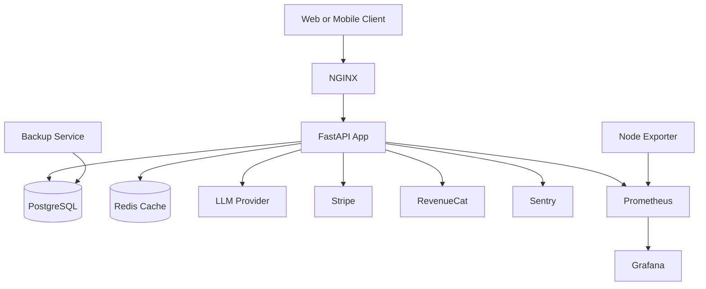
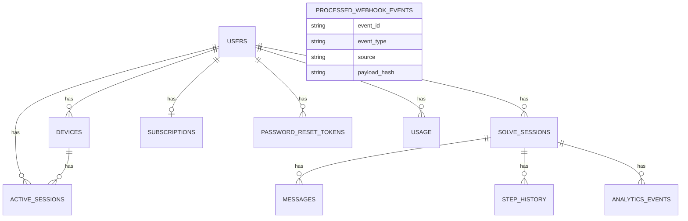

# Architecture

This document describes the system architecture, technology stack, data model, caching strategy, and API design principles for Solacore API.

## System architecture diagram

## Technology stack

- API: FastAPI
- Language: Python 3.11
- ORM: SQLAlchemy (async)
- Migrations: Alembic
- Database: PostgreSQL 15
- Cache: Redis
- Rate limiting: SlowAPI
- Observability: Prometheus, Grafana, Sentry
- Reverse proxy: NGINX
- Runtime: Docker Compose

## Directory structure

- `app/`: application code
  - `routers/`: API routes
  - `services/`: business logic
  - `models/`: SQLAlchemy models
  - `schemas/`: Pydantic schemas
  - `middleware/`: middleware (rate limit, CSRF)
  - `utils/`: shared utilities (metrics, cache, health, sentry)
- `alembic/`: database migrations
- `monitoring/`: Prometheus, Grafana dashboards, alerts
- `nginx/`: NGINX configuration
- `scripts/`: operational scripts (backups, hooks)
- `tests/`: test suite

## Database design (ER diagram)

Key tables:
- `users`: core identities
- `devices`: device bindings per user
- `active_sessions`: access token sessions
- `solve_sessions`: Solve session lifecycle
- `messages`: chat history per solve session
- `step_history`: Solve step timing and counts
- `analytics_events`: product analytics
- `subscriptions` and `usage`: billing state and usage counts
- `password_reset_tokens`: password reset workflow
- `processed_webhook_events`: webhook idempotency

## Caching strategy

Redis is used as a read-through cache for frequently accessed entities. TTLs are defined in `app/services/cache_service.py`:

- user: 600s
- subscription: 300s
- sessions: 120s
- device: 1800s

Guidelines:
- Cache on read for entities with stable schemas.
- Invalidate cache after write operations that modify the entity.
- Prefer short TTLs for session-like data.
- Treat Redis as an acceleration layer, not a source of truth.

## API design principles

- RESTful endpoints with clear nouns and HTTP methods.
- Consistent error responses with `error` and `detail` fields.
- Authentication via Bearer tokens or httpOnly cookies.
- CSRF protection required for cookie-based writes.
- Rate limiting by IP and user for abuse prevention.
- SSE for long-running streaming responses.
- Webhooks are idempotent (tracked in `processed_webhook_events`).
- Health endpoints for liveness, readiness, and metrics.
- Backwards-compatible changes by default; avoid breaking changes.
