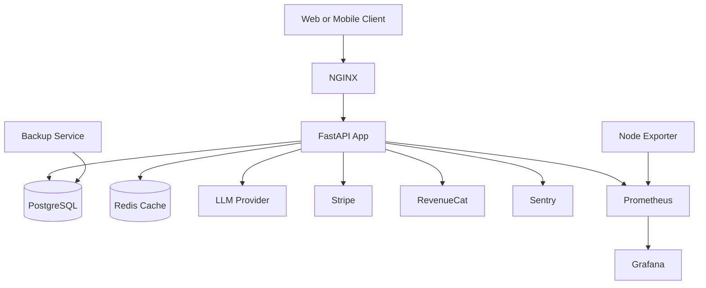
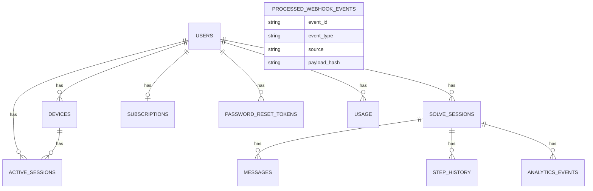

# Architecture

This document describes the system architecture, technology stack, data model, caching strategy, and API design principles for Solacore API.

## System architecture diagram

## Technology stack

- API: FastAPI
- Language: Python 3.11
- ORM: SQLAlchemy (async)
- Migrations: Alembic
- Database: PostgreSQL 15
- Cache: Redis
- Rate limiting: SlowAPI
- Observability: Prometheus, Grafana, Sentry
- Reverse proxy: NGINX
- Runtime: Docker Compose

## Directory structure

- `app/`: application code
  - `routers/`: modular API routes (see below)
  - `startup/`: application initialization modules
  - `services/`: business logic
  - `models/`: SQLAlchemy models
  - `schemas/`: Pydantic schemas
  - `middleware/`: middleware (rate limit, CSRF, auth)
  - `utils/`: shared utilities (metrics, cache, health, sentry)
- `alembic/`: database migrations
- `monitoring/`: Prometheus, Grafana dashboards, alerts
- `nginx/`: NGINX configuration
- `scripts/`: operational scripts (backups, hooks)
- `tests/`: test suite

### Modular router architecture

The API has been refactored into a modular architecture to improve maintainability and reduce merge conflicts. Large monolithic route files have been split into focused modules.

#### Auth module (app/routers/auth/)

10 submodules managing authentication and user sessions:

- `__init__.py` - Route aggregation (prefix `/auth`, tag `Auth`)
- `csrf.py` - CSRF token generation endpoint
- `register.py` - User registration with email/password
- `login.py` - Login and beta login endpoints
- `oauth.py` - OAuth authentication (Google, Apple)
- `password_reset.py` - Password reset workflow
- `tokens.py` - Token refresh and logout
- `user.py` - User info, device management, session management
- `config.py` - Auth configuration endpoint
- `utils.py` - Shared helpers (`create_auth_response`, `set_auth_cookies`)

**Design pattern**: Each module defines a router without prefix/tags, then `__init__.py` aggregates them with a common prefix. This prevents route path conflicts and allows flexible organization.

**Benefits**: Reduced code duplication (50+ lines eliminated via `create_auth_response`), easier to locate specific endpoints, reduced cognitive load.

#### Sessions module (app/routers/sessions/)

6 submodules managing Solve sessions:

- `__init__.py` - Route aggregation (prefix `/sessions`, tag `Sessions`)
- `create.py` - Create new Solve sessions
- `list.py` - List sessions, retrieve session details, get message history
- `stream.py` - SSE streaming for real-time messages
- `update.py` - Update session title and status
- `delete.py` - Delete sessions
- `utils.py` - Shared constants, rate limit configs, helper functions

**Key improvements**: SSE streaming logic isolated in `stream.py`, reusable utilities prevent repetition, average file size ~150 lines (down from 841).

#### Learn module (app/routers/learn/)

5 submodules managing learning sessions:

- `__init__.py` - Route aggregation + methodology prompt templates (Feynman, Chunking, GROW, etc.)
- `create.py` - Create learning sessions with different methodologies
- `message.py` - Send messages and SSE streaming for learning responses
- `history.py` - Retrieve session details and message history
- `utils.py` - Validation, context building, review schedule generation

**Design choice**: `__init__.py` contains the large methodology prompt templates (5 types) to keep them centralized, while logic is in dedicated modules.

#### Startup module (app/startup/)

6 modules managing application initialization:

- `__init__.py` - Exports `create_app` factory function
- `app.py` - Application factory (integrates all startup modules)
- `config.py` - OpenAPI documentation configuration (tags, security schemes)
- `lifespan.py` - Lifecycle events (startup validation)
- `middleware.py` - Middleware stack (CORS, CSRF, rate limiting, metrics, Sentry)
- `routes.py` - Route registration and exception handlers

**Impact**: `main.py` reduced from 480 lines to 13 lines (97% reduction), startup logic clearly separated by concern.

### Refactoring metrics

| Module | Before | After | Files | Avg lines/file | Reduction |
|--------|--------|-------|-------|----------------|-----------|
| Auth | 899 lines | 1062 lines | 10 | 106 | Code dedup (-50 lines) |
| Sessions | 841 lines | 951 lines | 6 | 158 | Single responsibility |
| Learn | 680 lines | 734 lines | 5 | 147 | Isolated utilities |
| Startup | 480 lines | 604 lines | 6 | 100 | 97% main.py reduction |

**Overall benefits**:
- Maintainability: Easier to locate and modify specific features
- Collaboration: Reduced merge conflicts (multiple developers can work on different modules)
- Testability: Utilities isolated for unit testing
- Code quality: Reduced cyclomatic complexity (all functions < 10 complexity)

## Database design (ER diagram)

Key tables:
- `users`: core identities
- `devices`: device bindings per user
- `active_sessions`: access token sessions
- `solve_sessions`: Solve session lifecycle
- `messages`: chat history per solve session
- `step_history`: Solve step timing and counts
- `analytics_events`: product analytics
- `subscriptions` and `usage`: billing state and usage counts
- `password_reset_tokens`: password reset workflow
- `processed_webhook_events`: webhook idempotency

## Caching strategy

Redis is used as a read-through cache for frequently accessed entities. TTLs are defined in `app/services/cache_service.py`:

- user: 600s
- subscription: 300s
- sessions: 120s
- device: 1800s

Guidelines:
- Cache on read for entities with stable schemas.
- Invalidate cache after write operations that modify the entity.
- Prefer short TTLs for session-like data.
- Treat Redis as an acceleration layer, not a source of truth.

## API design principles

- RESTful endpoints with clear nouns and HTTP methods.
- Consistent error responses with `error` and `detail` fields.
- Authentication via Bearer tokens or httpOnly cookies.
- CSRF protection required for cookie-based writes.
- Rate limiting by IP and user for abuse prevention.
- SSE for long-running streaming responses.
- Webhooks are idempotent (tracked in `processed_webhook_events`).
- Health endpoints for liveness, readiness, and metrics.
- Backwards-compatible changes by default; avoid breaking changes.
